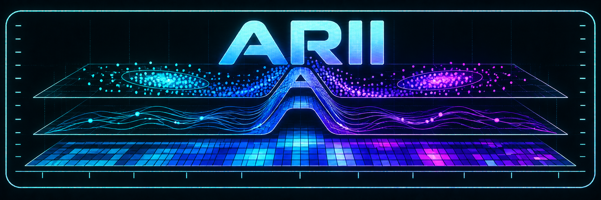

<p align="center">
  
</p>

<p align="center">
  <a href="https://github.com/EXCI5ION/Arii/releases/latest">
    
  </a>
  <a href="https://doi.org/10.5281/zenodo.23167788">
    
  </a>
</p>

Arii es una aplicación de código abierto para el análisis quimiométrico
reproducible de matrices ómicas. Proporciona una interfaz gráfica para
PCA, PLS-DA y OPLS-DA sobre el paquete `mixOmics` sin exigir que el usuario trabaje desde
la consola de R.

Está orientada inicialmente a metabolómica, pero admite tanto perfiles
continuos como tablas de características procedentes de otras plataformas.

La ejecución local y el primer adaptador remoto Slurm comparten un contrato de trabajo.
Los perfiles de clúster conservan sólo configuración no secreta (Consulte docs/cluster-execution-design.md).
La configuración inicial está disponible en la GUI; una guía sin conocimientos previos se encuentra en docs/cluster-user-guide.md.

Versión actual: **1.0.0**.

## Descargar para Windows

[Descargar Arii 1.0.0 para Windows de 64 bits](https://github.com/EXCI5ION/Arii/releases/download/v1.0.0/Arii-1.0.0-windows-x64.exe)

El instalador incluye Arii, sus workers estadísticos y un runtime privado de R
con [`mixOmics`](https://mixomics.org/).

Consulte la [última versión publicada](https://github.com/EXCI5ION/Arii/releases/latest) y
sus notas de lanzamiento.

### Servidor o clúster Linux — consola

No es necesario instalar R, Python, Conda ni `mixOmics` en el servidor. El runtime completo puede instalarse en el espacio personal
del usuario con:

```bash
ARII_VERSION=1.0.0
wget -O install-arii-server.sh \
  "https://raw.githubusercontent.com/EXCI5ION/Arii/v${ARII_VERSION}/cluster/install-server.sh"
less install-arii-server.sh
ARII_VERSION="$ARII_VERSION" bash install-arii-server.sh
```

El instalador usa `curl` o `wget`. Al terminar
muestra la ruta exacta de `Rscript` que debe introducirse en Arii y el comando
opcional de prueba mediante Slurm.

## Instalación desde el código fuente

Arii 1.0.0 requiere **Python 3.12** y la serie **R 4.5.x**. Las instalaciones desde código fuente
usan [Bioconductor 3.22](https://bioconductor.org/news/bioc_3_22_release/),
compatible con R 4.5.

### Windows — PowerShell

Instala previamente [Python 3.12](https://www.python.org/downloads/) y
[R 4.5.2 para Windows](https://cran.r-project.org/bin/windows/base/old/4.5.2/R-4.5.2-win.exe), y asegúrate de que
`Rscript.exe` esté disponible en `PATH`.

```powershell
git clone --branch v1.0.0 --depth 1 https://github.com/EXCI5ION/Arii.git
cd Arii
py -3.12 -m venv .venv
.\.venv\Scripts\Activate.ps1
python -m pip install --upgrade pip
python -m pip install .
Rscript -e 'if (!requireNamespace("BiocManager", quietly=TRUE)) install.packages("BiocManager", repos="https://cloud.r-project.org"); BiocManager::install(version="3.22", ask=FALSE); BiocManager::install("mixOmics", ask=FALSE, update=FALSE); install.packages("jsonlite", repos="https://cloud.r-project.org"); stopifnot(requireNamespace("mixOmics", quietly=TRUE), requireNamespace("jsonlite", quietly=TRUE))'
arii-gui
```

Si PowerShell bloquea la activación del entorno, ejecuta directamente `.\.venv\Scripts\python.exe -m pip ...`.

### Linux

Instala Python 3.12, las bibliotecas gráficas que requiera Qt y **R 4.5.3**.
Si tu distribución no conserva esa versión, está disponible el
[código fuente oficial de R 4.5.3](https://cran.r-project.org/src/base/R-4/R-4.5.3.tar.gz).
Después ejecuta:

```bash
git clone --branch v1.0.0 --depth 1 https://github.com/EXCI5ION/Arii.git
cd Arii
python3 -m venv .venv
source .venv/bin/activate
python -m pip install --upgrade pip
python -m pip install .
Rscript -e 'if (!requireNamespace("BiocManager", quietly=TRUE)) install.packages("BiocManager", repos="https://cloud.r-project.org"); BiocManager::install(version="3.22", ask=FALSE); BiocManager::install("mixOmics", ask=FALSE, update=FALSE); install.packages("jsonlite", repos="https://cloud.r-project.org"); stopifnot(requireNamespace("mixOmics", quietly=TRUE), requireNamespace("jsonlite", quietly=TRUE))'
arii-gui
```

### macOS

Instala Python 3.12, [R 4.5.3 para Apple silicon](https://cran.r-project.org/bin/macosx/big-sur-arm64/base/R-4.5.3-arm64.pkg)
o [R 4.5.3 para Intel](https://cran.r-project.org/bin/macosx/big-sur-x86_64/base/R-4.5.3-x86_64.pkg), según tu equipo, y
[XQuartz](https://www.xquartz.org/), requerido por `mixOmics` en macOS. En una terminal `bash` o `zsh` ejecuta:

```bash
git clone --branch v1.0.0 --depth 1 https://github.com/EXCI5ION/Arii.git
cd Arii
python3 -m venv .venv
source .venv/bin/activate
python -m pip install --upgrade pip
python -m pip install .
Rscript -e 'if (!requireNamespace("BiocManager", quietly=TRUE)) install.packages("BiocManager", repos="https://cloud.r-project.org"); BiocManager::install(version="3.22", ask=FALSE); BiocManager::install("mixOmics", ask=FALSE, update=FALSE); install.packages("jsonlite", repos="https://cloud.r-project.org"); stopifnot(requireNamespace("mixOmics", quietly=TRUE), requireNamespace("jsonlite", quietly=TRUE))'
arii-gui
```

En Linux y macOS, Arii 1.0.0 depende además de la compatibilidad de Qt con el
sistema. `mixOmics` se instala mediante `BiocManager`, el método recomendado por
Bioconductor. El instalador de Windows y el runtime para clúster ya contienen R
y todas estas dependencias, por lo que sus usuarios no deben instalarlas por
separado.

## Funcionalidades

En su versión 1.0.0, Arii permite:

- importar matrices CSV, TSV y TXT con muestras en filas o columnas;
- trabajar con perfiles continuos y tablas de características discretas;
- asignar clases e individuos biológicos desde una tabla editable;
- aplicar centrado y escalado Pareto, de varianza unitaria o sin escalado;
- calcular PCA, PLS-DA y OPLS-DA mediante `mixOmics`;
- evaluar modelos supervisados con Random Subsets, Monte Carlo, leave-one-out o
  Venetian blinds;
- seleccionar la complejidad del modelo y consultar R²X, R²Y, Q²Y, BER,
  exactitud, matrices de confusión y ROC/AUC;
- explorar scores, loadings, T² de Hotelling y gráficos de valores de carga;
- ejecutar tests de permutaciones empíricos y comparaciones residuales;
- guardar datos, configuración y resultados en proyectos `.arii`;
- exportar figuras ráster con dimensiones exactas y los vectores necesarios
  para reproducir gráficos de valores de carga;
- ejecutar modelos localmente o distribuir validaciones y permutaciones en un
  clúster Slurm.

## Proyectos reproducibles

Los proyectos `.arii` conservan clases, individuos, muestras excluidas, estilos,
parámetros y resultados numéricos. El dataset original no se duplica: se
registra su ruta y su huella SHA-256. Si el archivo cambia, Arii lo advierte al
volver a abrir el proyecto.

## Ejecución en servidor o clúster

[`Arii-1.0.0-cluster-runtime-linux-x86_64.tar.gz`](https://github.com/EXCI5ION/Arii/releases/download/v1.0.0/Arii-1.0.0-cluster-runtime-linux-x86_64.tar.gz)
es exclusivamente el motor de cálculo para servidores y clústeres Linux x86-64
compatibles con glibc 2.28 o posterior.

Consulta la [guía de uso del clúster](docs/cluster-user-guide.md) y las
[instrucciones del runtime de servidor](cluster/runtime/README-SERVER.md).


## Desarrollo y pruebas

Para instalar las dependencias de desarrollo y ejecutar la suite:

```bash
python -m pip install -e ".[dev]"
python -m pytest -q
```

## Cómo citar

Los metadatos de autoría y versión se encuentran en
[`CITATION.cff`](CITATION.cff). GitHub puede generar desde ese archivo una
referencia en formatos APA y BibTeX.

Para citar exactamente Arii 1.0.0, utilice el DOI específico
[`10.5281/zenodo.23167789`](https://doi.org/10.5281/zenodo.23167789). El DOI
conceptual [`10.5281/zenodo.23167788`](https://doi.org/10.5281/zenodo.23167788)
representa el proyecto Arii y dirige siempre a su versión más reciente.

## Licencia

Copyright (C) 2026 Gabriel Anderson.

Arii es software libre distribuido bajo la
[GNU General Public License](LICENSE) (`GPL-3.0-or-later`). Los componentes de
terceros conservan sus propias licencias; consulta
[`THIRD_PARTY_NOTICES.md`](THIRD_PARTY_NOTICES.md).
